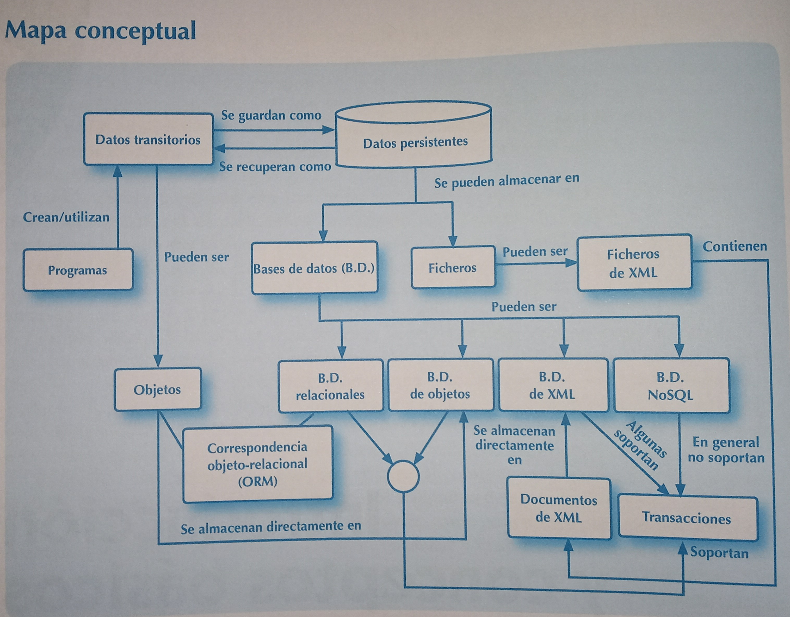
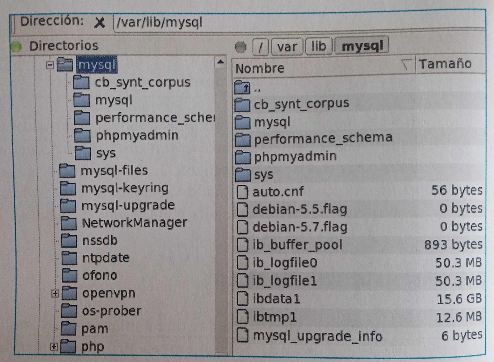
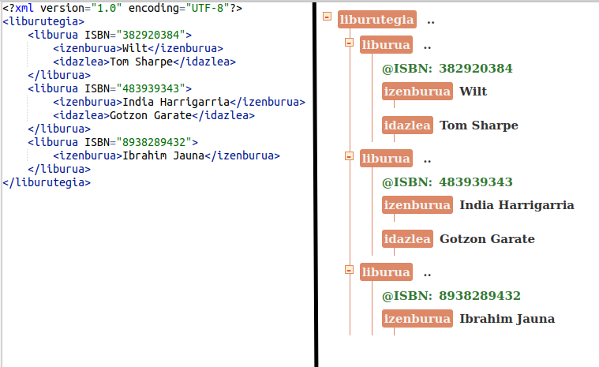

# Datu atzipena (DAM)

## 1. Sarrera eta oinarrizko kontzeptuak

+ ### 1.1 Programak eta datuak

Informazioa hainbat modutan egituratuta egon daitezkeen datuen bidez adierazten da.

1. **Memoria nagusia**: Bere edukia ezabatu egiten da ordenagailua itzaltzean. Kapazitate txikia du baina datuetara sartzeko denbora oso laburra da. Adib. RAM memoria.

2. **Bigarren mailako biltegiratzea**: Datuak modu iraunkorrean (*persistente*) gordetzen diren tokia. Adib. HDD diska.

+ ### 1.2 Datuen iraunkortasuna

Programek soilik memoria nagusian dauden datuak atzitu ditzakete. Datuak memoria nagusian sor ditzakete eta bigarren mailako biltegiratzean gorde, iraunkortasuna edo persistentzia bermatzeko.

+ ### 1.3 Datuak iraunarazteko sistemak

Azken batean, **datu iraunkorrak fitxategietan gordetzen dira beti**, bigarren mailako biltegiratze batean. 

+ ### 1.4 Datuen biltegiratzea

#### 1.4.1 Fitxategiak

Fitxategi bat *byte*-sekuentzia bat besterik ez da. 
Oinarrizko euskarri honen gainean **edozein informazio mota** adieraz daiteke.

#### 1.4.2 Datu base erlazionalak
Datuak **tauletan** antolatzen dira eta hauen arteko erlazioak ezarri daitezke.

Gaur egun datu base erlazionalak dira erabilienak. **SQL** da erabiltzen den lengoaia estandarra.

#### 1.4.3 XML dokumentuak
Informazioa modu jerarkikoan antolatzen da (zuhaitz itxura hartzen du).

XML dokumentu bat testu-fitxategi batean gorde daiteke edo XML datu base batean.

#### 1.4.4 Objektuen datu baseak
Datu base mota honek objektuak gordetzen ditu, grafo itxura hartuz.

#### 1.4.5 NoSQL datu baseak
Oro har, oso egitura sinpleak eta, aldi berean, oso malguak erabiltzen dituzte.

### 1.5 Integritate murrizketak
Integritate-murrizketak biltegiratutako datuek bete beharreko baldintzak dira. Datu partikularretarako eta erlazionatuetarako defini daitezke.

Datuen gaineko aldaketa baten emaitzak integritate-murrizketaren bat urratzen badu, ez da onartuko.

### 1.6 Datu atzipena iteratzaileekin
Kontsulta baten emaitza guztiak memoria nagusira pasatzea ez da komeni, oro har, asko izan daitezkeelako. Iteratzaile bat kontsulta baterako sortzen da eta emaitzak banan-banan lortzeko aukera ematen du. Datuak bigarren mailako biltegiratzetik berreskuratzeko eragiketak nahiko motelak direnez, bakoitzean datu-blokeak berreskuratu ohi dira, nahiz eta ondoren iteratzaileak banan-banan eman.

### 1.7 Sarrera konkurrenteak eta transakzioak kontrolatzea
Biltegiratutako datuak aplikazio askoren artean partekatuak izan daitezke eta irakurketa/modifikazioak jasan ditzakete aldi berean. Horregatik, datu atzipena kontrolatu beharra dago. 

**Transakzio** bat, datuen sendotasuna mantenduz, beronen egoerak aldatzen dituen ekintza-multzo banaezina da, hau da, multzoko ekintza guztiak burutuko dira ala ez da bat bera ere burutuko.

Irakurtzeko eta idazteko eragiketen sinkronizazioak eta transakzioek bermatzen dute aplikazio-programek beti dutela biltegiratutako datuen ikuspegi sendoa, eguneratua eta zuzena.

Transakzio batek bete behar dituen ezaugarriak **ACID** akronimoarekin laburbildu ohi dira (*atomic, consistent, isolated, durable*).

+ *Atomic*: 
Transakzio bat osorik ejekutatu behar da errorerik gabe. Akatsen bat gertatzen bada, egindako aldaketak desegin behar dira, hasierako egoerara itzuliz.

+ *Consistent*: 
Datuetarako definitutako integritate-murrizketak transakzioan sartutako eragiketa bakoitzaren ondoren bete behar dira, baita transakzio amaitzean ere.

+ *Isolated*: Transakzioak isolatuta exekutatuko dira modu paraleloan, betiere ez badute beren arteko gatazka sortzen (adibidez, taula bateko elementu bera modifikatzea). Exekuzioaren bukaerak transakzioak sekuentzialki exekutatuko balira bezala izan behar da.

+ *Durable*: Behin transakzio bateko eragiketa guztiak burututa, aldaketak baieztatzen dira, eta ez lehenago.

Transakzioek dituzten abantaila guztien kontra, beren eraginkortasuna txikitzea dakar. Esaterako, NoSQL-k ez ditu transakzioak erabiltzen erabilgarritasun eta eraginkortasun handiagoak izatearen alde.

### 1.8 Datuen iraunkortasuna Fitxategietan
Fitxategiak dira oinarrizko biltegiratze baliabideak. 
Fitxategi bat, funtsean, *byte*-sekuentzia bat da, eta, beraz, hasiera batean edozein motatako informazioa gorde dezake.

Fitxategi batek izen bat du eta direktorio jakin batean dago, direktorio-hierarkia baten barruan.

Hainbat desabantaila ditu: errendimendu baxua, konkurrentzia arazoak, erredundantzia,... 

Fitxategiak ez dira egokiak aplikazio konkurrente askori zerbitzua emateko.

### 1.9 Datuen iraunkortasuna Datu Base Erlazionaletan
Gaur egun, datuak biltegiratzeko erabilienak. 

Sendotasun handia oinarri matematiko sendoetatik dator, eredu formal batean oinarritzen baitira: **eredu erlazionalean**.

Erabilerarako lenguaia estandar bat existitzen da: **SQL**.
Honen bidez eskema erlazionalak sor daitezke (taula multzoak), integritate murriztapenak definitu daitezke, ...

SQL hizkuntza adierazgarria edo *declaratiboa* da (lortu nahi den emaitza adierazten da, baina ez nola lortu behar den), oso maila altukoa. Sistemak berak automatikoki sortzen ditu indize batzuk, definitutako integritate-murrizketen arabera. Oso eskalagarriak dira eta transakzioetarako euskarri bikaina dute. Segurtasun-kopiaren eta berreskuratze-kopiaren mekanismo sofikstikatuak dituzte.

Ia programazio-lengoaia guztiek datu-base erlazionaletarako **API**ak dituzte. Adibidez, JDBC Java lengoaiarentzat.

***<a id="erlazional3puntu">Eredu erlazionalak 3 ezaugarri ditu:</a>***
1. Datuak Tauletan egituratzen dira
2. SQL lengoaia erabili
3. Integritate murrizketetarako eta transakzioetarako euskarria

#### 1.9.1 XML datu iraunkortasuna DB erlazionaletan
XML datuak trukatzeko erabiltzen den formatua da. Gainera, SQL kontsultak egin daitezke taulen gainean eta baita XML dokumentuetan ere.

#### 1.9.2 Objektuen iraunkortasuna DB erlazionaletan
Objektuak eredu erlazionaletan erabiltzea ez da erreza. 

Arazo honen aurrean 2 aukera sortu dira:

1. Datu base objektu-erlazionalak
2. Mapaketa objektu-erlazionala (ORM)

### 1.10 Datuen iraunkortasuna Objektuen datu baseetan
Zuzeneak objektuak gordetzea ahalbideratzen dute. Gaur egungo erabilera oso mugatua da.

### 1.11 Datuen iraunkortasuna XML natiboen datu baseetan

XMLrako berariaz diseinatutako eta optimizatutako datuak biltegiratzeko egiturak eta mekanismoak sortzea, bai eta lengoaia estandarretarako euskarria ere, XML dokumentuen gainean hainbat eragiketa mota egiteko aukera ematen dutenak: kontsulta (XPath eta XQuery), eguneratzea (XQueryren hainbat luzapen), transformazioa (XSL), eta balidazioa (XML Schema eta DTD).

### 1.12 Datuen iraunkortasuna NoSQL datu baseetan

NoSQLren gorakada, batez ere, datu heterogeneoen multzo erraldoiak bildu, kudeatu eta aztertzeko beharrari zor zaio, etengabe hazten ari baitira gero eta abiadura handiagoan. Hau da *Big Data* bezala ezagutzen da.

NoSQL batzuetan *"not only SQL"* gisa interpretatzen da. Ez du euskarririk ematen SQLrako.

NoSQL uler daiteke, "erlazionala ez den guztia" bezala. Hau da, eredu erlazionaleko [3 puntuetako](#erlazional3puntu) bat ere ez denean betetzen.

Datu base hauen ezaugarri ohikoenen artean:
- Biltegiraketa giltz-balio bidezko ***array***etan egin daiteke (adib. Casandra) edo **dokumentuetan** (adib. MongoDB).
- Datu base kudeatzaile bakoitzak bere lengoaia ez-deklaratiboa dauka. 
- ACID ezaugarrien aurretik erabilgarritasuna dago. **BASE** siglekin adierazita (*basic, availability, soft state, eventual consistency*). Hau da, oinarrizko erabilgarritasuna, egoera malgua eta denborarekiko sendotasuna

