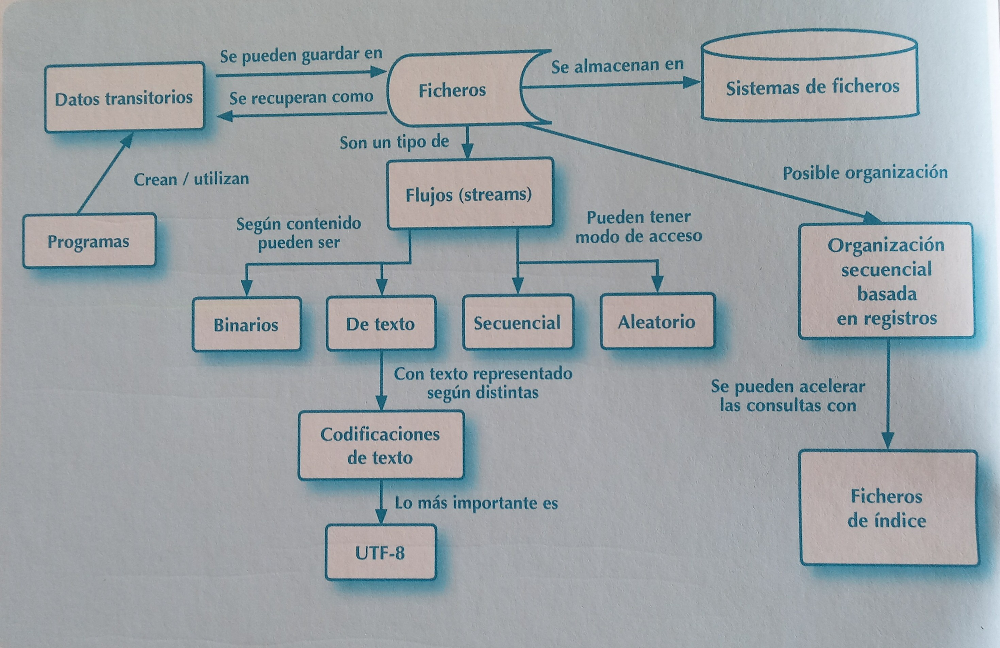
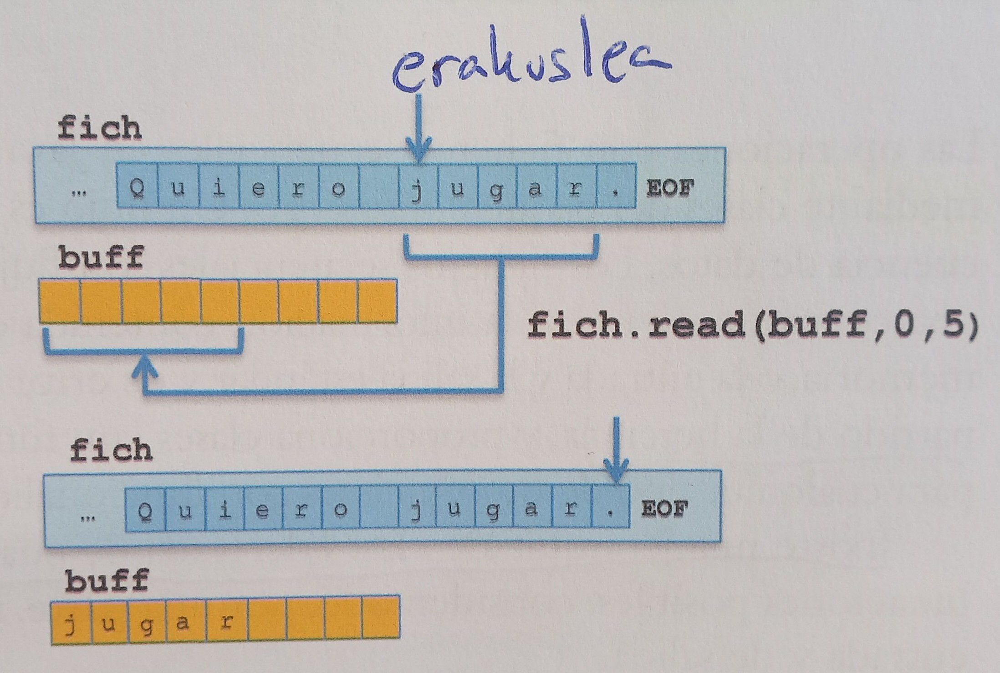
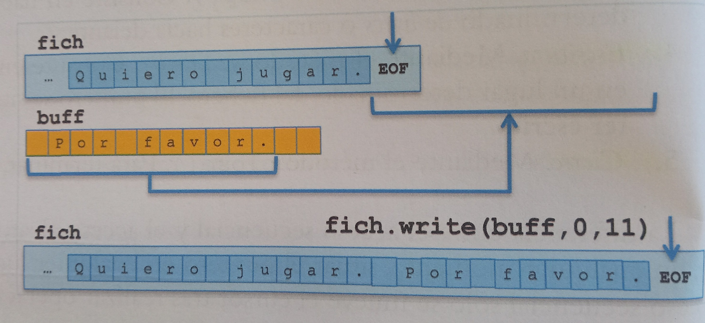
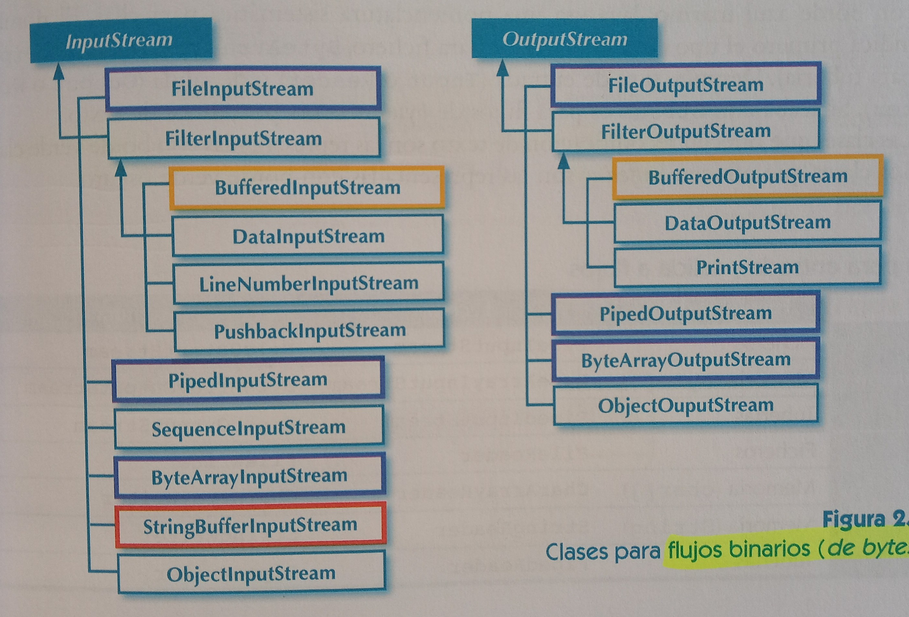
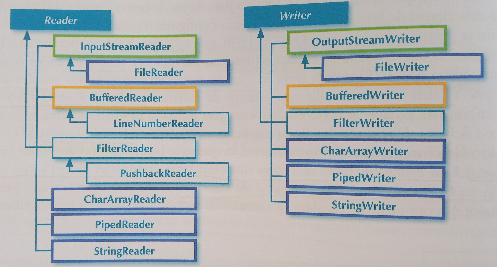
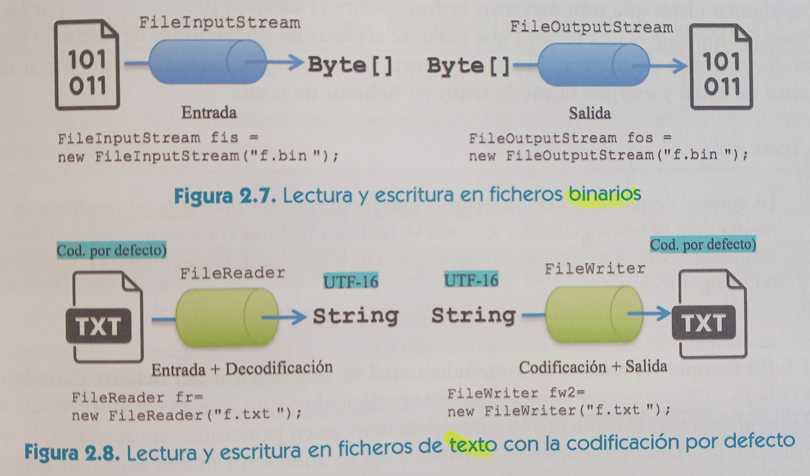
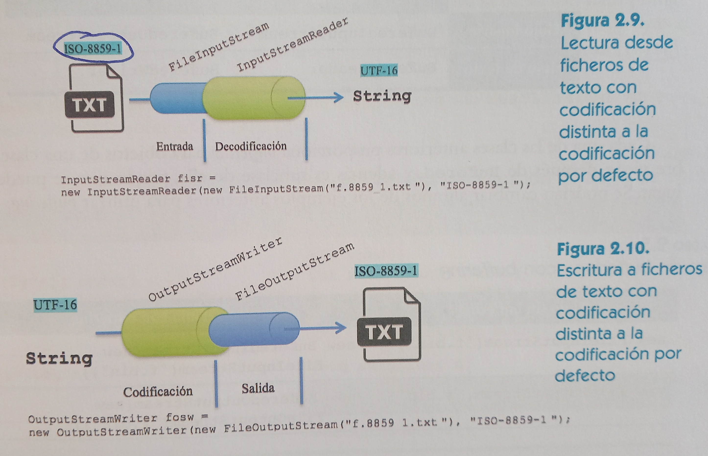
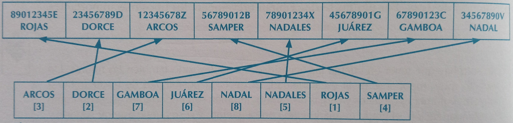

# 2. Fitxategiak

**Helburuak**:
- Testu fitxategi eta fitxategien bitarren kudeaketen ezberdintasunak ezagutzea.
- Fitxategietarako sarbide sekuentziala eta ausazkoa bereiztea
- Fitxategiak erabiltzeko Java klase nagusiak ikastea 
- Buffering-mekanismoa ulertzea, irakurketa eta idazketa eragiketak bizkortzeko.



### 2.1 Datuen iraunkortasuna fitxategietan


Fitxategiak dira informazioa biltegiratzeko metodorik oinarrizkoena. Izan ere, **azken batean, biltegiratzeko metodo guztiek**, nahiz eta sofistikatuak izan, **datuak fitxategietan gordetzen dituzte**.

Datu base erlazionalak agertu zirenera arte (80. hamarkada), fitxategiak ziren datuak gordetzeko baliabide erabilienak. Gaur egun, fitxategietan gordetzen diren datuak *XML, JSON, YAML*, ... formatukoak dira. *CSV* formatuko fitxategiak ere erabiltzen dira, besteak beste exportazio-inportazio sinpleak egiteko.

### 2.2 Fitxategi motak edukiaren arabera

Fitxategi bat *byte*-sekuentzia bat besterik ez da, eta, beraz, hasiera batean edozein informazio mota gorde dezake.

Fitxategi bat bere izenagatik eta kokapenagatik (fitxategi hierarkia baten) identifikatzen da.

Bi talde nagusi bereizten ditugu:
* **Testu fitxategiak**: karaktere-sekuentzia bat baino ez dute. Horiek ageriko karaktereak izan daitezke, hala nola letrak edo zenbakiak eta baita espazioak eta bereizgailuak ere, hala nola tabuladoreak eta lerro jauziak. Edozein testu editorekin ireki/editatu daitezke (notepad, nano, ...)

* **Fitxategi bitarrak**: gainontzeko fitxategiak dira. Normalean, programa bereziak behar dira bertako edukia bistaratzeko.

### 2.3 Testu kodifikatzaileak
Testu berdina, kodifikazioaren arabera, byte sekuentzia bat edo bestez errepresentatu daiteke. Gaur egun **Unicode** edo **UTF-8** kodifikazioak erabiltzea gomendatzen da.

UTF-8 bateragarria da ASCII kodearekin; horrek esan nahi du ASCIIn kodetutako edozein testu berdin-berdin adierazten dela UTF-8n. Hori funtsezko arrazoia izan da UTF-8 oro har hartzeko.

### 2.4 Javako File klasea

Fitxategiekin lan egitea ahalbidetzen duten klaseak <code>java.io</code> paketean daude.

Dokumentazioa (SE8): http://docs.oracle.com/javase/8/docs/api

<code>File</code> klaseak direktorio eta fitxategiei buruzko informazioa eskuratzea ahalbideratzen du, fitxategi sistema baten barruan. [File klase erabilera adibidea](/adibideak/01-Fitxategiak/ListadoDirectorio.java).

Javaz egindako edozein programatan komando lerro bidez aldagaiak pasatu daitezke, <code>String args[]</code> aldagaiak jasotzen ditu sarrera parametro horiek.

> Proposatutako Ariketa: aurreko adibideko programa aldatu, fitxategiei buruzko informazio gehiago erakus dezan: fitxategien tamaina, fitxategi eta direktorioen baimenak eta azken aldatze data.

### 2.5 Salbuespenak (*exception*) kudeatzea javan

Salbuespena da programa bat gauzatzean gertatzen den gertaera bat, programa gauzatzeko ohiko bidea eteten duena. Adibidez, zenbaki bat zati 0 egitean.

<code>Exception in thread "main" java.lang.ArithmeticException: / by zero</code> errorea itzuliko luke.

#### 2.5.1 Salbuespenak atzematea eta kudeatzea

Salbuespen bat dagoenean **kudeatu gabe**, programaren exekuzioa bertan behera uzten da. Salbuespenen bat ematen duten kode zati guztiak kudeatuak egon beharko lirateke.

[Salbuespen adibidea](adibideak/01-Fitxategiak/ZatiZeroSalbuespena.java), zati zero egitean.

> Proposatutako ariketa: Nola aldatuko litzateke aurreko programa, try/catch bloke asko egon beharrean bakarra egongo balitz 3 eragiketetarako?

#### 2.5.2 Salbuespen ezberdinen kudeaketa

<code>try{} catch{}</code> bloke batean salbuespen mota ezberdinak kudeatu daitezke.

>> Kontuan izan, praktikan *loggin* edo logak gordetzen dira programaren nondik norakoak gordetzeko (error, warning, info eta debug logak).

Salbuespen ezberdinen kudeaketa [adibidea](adibideak/01-Fitxategiak/SalbuespenDesberdinak.java).

#### 2.5.3 Klase bateko metodoan ezarritako salbuespenak

Konpilatzaileak ikusten badu klase bateko metodo batek errorea emon dezakela eta ez dagoela <code>catch(){}</code> bloke batekin kudeatua, **konpilazioa errorez bukatu**ko da.

Metodo bat throw salbuespenarekin [adibidea](adibideak/01-Fitxategiak/SalbuespenakThrowrekin.java).

#### 2.5.4 Salbuespenak, hasieratzea eta baliabideak askatzea: <code>finally</code> eta <code>try</code> blokeak baliabideekin

Java programa baten egitura orokorra honakoa da:

```
Hasieratzea eta baliabide esleipena
Gorputza
Bukaera eta baliabide askapena
```
**Lehenengo eta bukaerako zatiak beti exekutatu behar dira**, naiz eta gorputzean erroreak edo salbuespenak gertatu. 

Sarritan, gorputzeko baldintzaren bat betetzen bada exekuzioa bukatu nahi izaten da <code>return, break, continue</code> batekin adibidez. Baina hau eginda, ez da bukaerako kode zatia exekutatuko. Baina bukaera atala <code>finally {}</code> bloke barruan sartzen bada, funtziotik/programatik irten aurretik beti exekutatuko da, naiz eta aurretik return bat egin.

Hemen finally erabiltzen duen programa baten [adibide](adibideak/01-Fitxategiak/ExcepcionesConFinally.java) bat.

### 2.6 Fitxategietara sarbide motak

Bi sarbide modu nagusi existitzen dira:
+ **Sarbide sekuentziala**: Fitxategiaren hasieratik irakurtzen da. Fitxategiaren edozein puntutara iristeko, aurreko guztiak igaro behar dira (aurreko eduki guztia pasatu behar da).

+ **Sarbide zuzena** (edo ausazkoa): Zuzenean sartzen da fitxategiaren edozein posiziotan dauden datuetara.

Sarbide modu biak baliatzen dira bai irakurketa eta idazketa eragiketetarako.

Sarbide sekuentziala izango da, adibidez, fitxategia *zinta magnetiko* batean badago, edo bi aplikazio sare konexio baten bidez komunikatzen direnean eta batak besteari datuak sekuentzialki bidaltzen dizkionean.

### 2.7 Fitxategikin egin daitezken eragiketak Javan

Fitxategi mota (bitarra edo testu-mota) eta sarbide mota (sekuentziala edo zuzena) alde batera utzita, fitxategien gaineko oinarrizko eragiketak funtsean berdinak dira.

Fitxategi batera sartzeko mekanismoa **erakusle** (*puntero*) batean eta ***buffer*** deitzen den memoria-eremu batean oinarritzen da. Erakusleak fitxategiko puntu batean kokatzen da, edo fitxategi bukaeran **EOF** (*End Of File*), fitxategiko azken byte-aren hondoren.

Fitxategi guztiekin egin daitezken eragiketak hauek dira:
1. Ireki: Fitxategi baten gainean edozein eragiketa egiteko, lehendabizi zabaldu egin behar da.

2. Irakurri: <code>read()</code> metodoaren bitartez. Fitxategiaren edukia irakurtzea memoriara ekarriz, hauekin lan egin al izateko. Erakuslea irakurritako azken karakterearen ostean jartzen da.

3. Salto: <code>skip()</code> metodoaren bitartez. Erakuslea byte kopuru bat aurrera bugitzean datza.

4. Idatzi: <code>write()</code> metodoaren bitartez. Memoriako eduki bat fitxategian idaztean datza. Erakuslea idatzitako karakterearen ostean kokatzen da.

5. Itxi: <code>close()</code> metodoaren bitartez.

#### 2.7.1 Irakurketa eragiketak
Fitxategi batetik irakurtzean, *buffer*a zehaztu behar da, non irakurritako datuak kokatuko diren. Ez bada byte edo karaktere kopurua zehazten, *buffer*a bete harte irakurriko du.



#### 2.7.2 Idazketa eragiketak
Fitxategi batean idaztean, *buffer*a eta byte kopurua adierazi behar da. *buffer*etik bidaltzen dira erakuslearen posiziora. Erakuslea fitxategi bukaeran badago, fitxategi bukaeran gehituko da.



Ez da existitzen modu zuzenik fitxategi baten erdian idazteko, baina fitxategi laguntzaileak (bitartekariak) erabil daitezke.

### 2.8 Fitxategietara sarbide sekuentziala Javan
Fluxuak (*streams*) erabiliz egiten da, <code>java.io</code> paketeko klaseen bidez. Pakete honek herentzia erabiltzen du 4 klasetatik eratorrita.

#### 2.8.1 Datu fluxuekin erlazionatutako klaseak
Sortu beharreko fluxu mota ezberdina izango da testu fitxategia bada edo fitxategi bitarra bada..

**Fluxu bitarrek** ez daukate misteriorik: *byte*-n fluxu bat irakurtzen dute <code>byte[]</code> motako aldagai batera, edo alderantziz.

**Testurako fluxuetan** aldiz, kodifikazioaren araberakoa izango da. UTF-8 erabilita esaterako, ez dago arazorik: kodifikazio honek **1-4 *byte* erabiltzen ditu karaktere bat adierazteko**.
- 1 byte: ASCII kodeko karaktereak
- 2 byte: Ingelesean existitzen ez den karaktere horo. Adib. ñ, tildedun karaktereak...
- 4 byte-ra arte: Alfabeto latindarrean oinarrituta EZ dauden karaktereak.

Javak memorian testua gordetzeko UTF-16 kodifikazioa erabiltzen du, beraz, irakurketa/idazketa guztiek **rekodifikazio** bat behar dute. (UTF-8 / UTF-16).

UTF-16 kodifikazioak 2 edo 4 *byte* erabiltzen ditu karaktere bat adierazteko, beste modu batera esanda, <code>char</code> motako aldagai bat edo bi (bakoitza 2 *byte* dira).

Javan, testuak *array* <code>char[]</code> batean edo <code>String</code> batean gordetzen dira UTF-16 kodifikazioarekin, karaktere sekuentzia bat bezala.

**Fluxuen idazketa eta irakurketarako, Javak 2 hierarkia klase ematen ditu: bat bitarrentzat eta beste bat testuentzat:**

- Fluxu bitarren klaseak:


- Testu fluxuen klaseak:


Klase batzuek *buffering*a baliatzen dute, irakurketa/idazketa eragiketa azkarragoak lortuz.

Bi adibide:


#### 2.8.2 Rekodifikaziorako klaseak

<code>InputStreamReader</code> eta <code>OutputStreamWriter</code> klaseek bi hierarkien arteko bitartekari gisa balio dute (fluxu bitarretik testurakoa, eta alderantziz).

Adibideak:


#### 2.8.3 *Buffering*erako klaseak
*Buffering*a irakurtzeko edo idazteko eragiketak bizkortzeko aukera ematen duen teknika da, *buffer* izeneko memoria trukatzeko gune bat erabiliz. Orokorrean gomendagarria da *Buffering*a erabiltzea.

*Buffer*rak beti adierazten du fitxategiaren atal baten egungo edukia. Irakurketa egitean ez da soilik ekartzen behar diren datuak, baizik eta gehiago bufferra bete arte. Honek fitxategirako beste sarbide batzuk egin beharra aurrezten du.


*Buffer*ra antzera erabil daiteke idazketa-eragiketetarako. Fitxategian zuzenean idatzi beharrean, *buffer*rean idazten da. *Buffer*raren edukiak fitxategian irauliko dira, soilik, idazketa eragiketa batek fitxategiaren zati bati *buffer*rean ataletik kanpo eragiten duenean, edo beste programa batek atal horretako informazioa irakurtzen duenean.


|               | Irakurketa                       | Idazketa |
| :---:         |     :---                         |     :--- |
| Fluxu Bitarra | <code>BufferedInputStream</code> | <code>BufferedOutputStream</code>    |
| Testu Fluxua  | <code>BufferedReader</code>      | <code>BufferedWriter</code>      |


Fluxuak *buffering* gabe eta *buffering*arekin:
| Fluxua *buffering* gabe | Fluxua *buffering*arekin |
| --- | --- |
| <code>new FileInputStream("f.bin")</code> | <code>new BufferedInputStream(new FileInputStream("f.bin"))</code> |
| <code>new FileOutputStream("f.bin")</code> | <code>new BufferedOutputStream(new FileOutputStream("f.bin"))</code> |
| <code>new FileReader("f.txt")</code> | <code>new BufferedReader(new FileReader("f.txt"))</code> |
| <code>new FileWriter("f.txt")</code> | <code>new BufferedWriter(new FileWriter("f.bin"))</code> |

Bufferinga eskeintzen duten klaseek baimentzen dute testu **lerro osoak** irakurtzea/idaztea:

|   Klasea     | Metodoa                       | Funtzionalitatea |
| :---:         |     :---                         |     :--- |
| BufferedReader | String <code>readLine()</code> | Uneko lerro bukaerara arte irakurtzen du.   |
| BufferedWriter  | void <code>newLine()</code>      | Lerro berri bat idazten du. Linux eta Windows sistema eragileetan desberdina da, baina <code>readLine()</code> metodoak kontuan hartzen du hau.      |

#### 2.8.4 Irakurtekak sarrera fluxuetan

<code>InputStream</code>etik jasotako klaseen <code>read</code> funtzioak *byte*ak irakurtzen dituzte, eta <code>Reader</code>rengandik jasotakoek, berriz, **karaktereak**.

Funtzio hauek irakurritako *byte* edo karaktere kopurua bueltatzen dute, eta bestela -1 balioa, ezin izan badute ezer irakurri (adibidez, erakuslea EOFean badago).

Testu fitxategiekin, lerroak irakurtzen dituen <code>readLine()</code> metodoa erabil daiteke, <code>[BufferedReader](https://docs.oracle.com/javase/8/docs/api/java/io/BufferedReader.html)</code> batena, <code>FileReader</code> baten gainean eraikita.

**Adibidea testu fitxategiekin**:

Hurrengo programak fitxategi bateko edukia [lerroz lerro irakurtzen/bistaratzen](adibideak/01-Fitxategiak/LerrozLerroIrakurri.java) du.

> Proposatutako ariketa 1:
Sortu testu-fitxategi batean emandako testu bat bilatuko duen programa bat, agerpen bakoitzerako lerroa eta zutabea erakutsiko dituena. Lerroz lerro fitxategia irakurtzea gomendatzen da, eta lerro bakoitzaren barruan, testuaren agerpenak bilatzea, String motako metodo egokia erabiliz. Mota horretako dokumentazioa Javako APIn kontsulta daiteke.

> Proposatutako ariketa 2:
UTF-8n kodigikatutako testu-fitxategi batetik abiatuta, ISO-8859-1en kodigikatutako testu-fitxategi bat eta UTF-16n kodifikatutako beste bat sortuko dituen programa bat sortzen du. UTF-8n kodetutako fitxategia testu-editore batekin sortu behar da, eta gutxienez bokal azentudunak izan behar ditu. Online fitxategia <code>readLine()</code>-rekin irakur dezakezu. Irteera-fitxategia sortzeko, <code>BufferedWriter</code> bat erabil dezakezu (lerroz lerro idazteko), <code>FileOutputStreamStream</code> (fitxategi batera idazteko) baten gainean bildua. Bilatu sistema eragilean erabiltzen ari zaren testu-fitxategien kodifikazioa egiaztatzeko modu bat, sistema eragileko komando baten edo erabilgarritasun-programaren baten bidez. Iraulketa bitarrerako adibide programak erabil ditzakezu, beste modu batean kodetzen diren karaktereak egiaztatzeko. Alderantzizko bihurketa egingo duen beste programa bat sor dezakezu, hasierakoa bezalako fitxategi bat berriro lortzen dela egiaztatzeko, <code>InputStreamReader</code> eta <code>FileInputStream</code> klaseak erabiliz.

**Adibidea fitxategi bitarrekin**:

[Programa honek](adibideak/01-Fitxategiak/BitarIrakurketa.java) fitxategi bitar bat kargatzen du. Fitxategien edukiak 32 *byte*ko blokeetan irakurtzen dira. *Byte*ak hexadezimalean idazten dira (base 16), beraz, byte bakoitza 2 karakterez errepresentatzen da.
Orokorrean, beti garatu behar dira *strems*ekin edo fluxuekin funtzionatzen duten programak.

> Proposatutako ariketa:
*BitarIrakurketa* klasea aldatzen du, edozein <code>PrintStream</code>-era iraulketa egin ahal izateko, <code>System.out</code>-era betiko egin beharrean. <code>main()</code> metodoa aldatzen du, iraulketa fitxategi baterantz egin dezan.

#### 2.8.5 Idazketa irteera fluxuetan

<code>write</code> funtzionak (<code>OutputStream</code> klasetik heredatuak) *byte*ak idazten dituzte eta <code>Writer</code>etik heredatuak karaktereak.

Erakuslea fitxategi bukaerara iristen bada, idazten jarraitzen du. <code>Writer</code>etik eratorriek <code>String</code>ak idazteko eta <code>append</code> egiteko metodoak dituzte (fitxategi bukaeran gehitzeko). 

<code>FileOutputStream</code> eta <code>Writer</code>en ezaugarri erabilgarri bat, beren eraikitzaileak (*constructor*) parametro bat **izan dezake** fitxategiaren bukaeran idatzi nahi den adierazteko (*append*). Parametro gabeko eraikitzailea ere badute.

```java 
FileOutputStream(File file, boolean append)
FileOutputStream(String fitxIzena, boolean append)
Writer(File file, boolean append)
Writer(String fitxIzena, boolean append)
```

[Programa honek](adibideak/01-Fitxategiak/IrteeraFluxuanIdatzi.java) testua idazten du fitxategi batean, gero itxi egiten du eta berriz ireki *append* bezala, fitxategi bukaeran zerbait gehitzeko. Lerro jausiak gehitzen dira <code>newLine()</code> erabiliz.

Ezinezkoa da fitxategi bateko edukiak zuzenean fluxuak erabiliz ezabatzea edo ordezkatzea, horretarako fitxategi berean irakurri eta idatzi behar delako. Fitxategi osagarriak erabil daitezke, <code>File</code> klaseko <code>createTempFile()</code> erabiliz sor daitezkeenak. Fitxategi hauek direktorio berezi batean sortzen dira (linuxen <code>/tmp</code> direktorioan).

### 2.9 Eragiketak sarbide zuzeneko fitxategiekin Javan

Fitxategien sarbide zuzenerako <code>RandomAccessFile</code> klasea erabiltzen da. Berezitasunak:

1. Erakuslea fitxategiko edozein puntutan kokatu daiteke <code>seek()</code> funtzioa erabiliz.
2. Fitxategiaren gainean idazketa eta irakurketa eragiketak egin daitezke.

Ezin dira fitxategi baten erdian ezabatu edo txertatu *byte*-blokeak edo karaktere-blokeak. Horretarako, aldi baterako fitxategi osagarriak erabili beharko dira.

[<code>RandomAccessFile</code>](https://docs.oracle.com/javase/8/docs/api/java/io/RandomAccessFile.html) klasea.

**Adibidea**

[Adibide honetan](klaseko_ariketak/1-TestuFitxategiak/FicheroAccesoAleatorio.java), bezero bakoitzaren datuak erregistro batean gordetzen dira. Erregistro hori luzera finkoko egitura bat da, luzera finkoko eremuetan banatua. Dituen erregistro kopurua kalkulatzen da, fitxategiaren luzera *byte*tan zatituz erregistro bakoitzaren luzerarekin. <code>txertatu</code> metodoa interesgarria da, posizioa zehazten ez bada, erregistroa fitxategi bukaeran gehituko du, bestela, zehaztutako posizioan. Lehen erregistroaren posizioa 0 da.


### 2.10 Fitxategien antolakuntza

Fitxategien antolaketa datuak fitxategien barruan antolatzeko eta egituratzeko modu bat da, edukiak behar bezala interpretatu ahal izateko.

Erregistro bakoitza identifikatzen duen aldagi bat (edo batzuk) egotea ohikoa da, *clave* edo **gakoa** deiturikoa.


Fitxategien organizazio batzuek egitura osagarriak izan ditzakete fitxategian bertan. Adibidez, fitxategian bertan goiburuko bloke bat sar liteke eremuen sekuentziaren aurretik, edo ixteko bloke bat gero. Bloke horietan sar liteke zenbat erregistro dituen.


Azken batean, fitxategi baten edukien antolamendu posible asko daude. Antolaketa sekuentziala eta **antolaketa sekuentzial indexatua**, biak luzera finkoko erregistroetan oinarrituta.

#### 2.10.1 Antolaketa sekuentziala

Fitxategia osatzen duten erregistroak bata bestearen atzetik biltegiratzen dira, eta ez daude inola ere ordenatuta. Erregistro konkretu bat bilatzeko hasieratik abiatu behar da aurkitu arte edo fitxategi bukaerara arte.

- Bilaketak ez dira eraginkorrak
- Erregistro baten ezabatzea ere ez da eraginkorra, hurrengo erregistro guztiak posizio bat atzeratzera behartzen duelako. Hobekuntza posible bat, erregistroa "ezabatuta" bezala markatzea izango litzateke, aldagai batean adibidez.
- Erregistroa txertatzea eraginkorra da, beti fitxategi bukaeran txertatzen delako.

#### 2.10.2 Antolaketa sekuentzial indexatua
Antolaketa honek aukera ematen du nahi den edozein eremutan bilaketa oso eraginkorrak egiteko, eremu horretarako **indize-fitxategi** bat sortzearen eta **mantentzearen** truke.

Indize-fitxategi bat fitxategi sekuentzial ordenatu bat besterik ez da, eta haren erregistroek bi eremu dituzte: bata indizea sortzen den eremuko balio baterako, eta bestea fitxategi sekuentzialean posizioa adierazten duena.



Ez da beharrezkoa fitxategi nagusia berrantolatzea erregistro bat gehitzean, baina bai indize-fitxategia (fitxategi txikiagoak dira).

Diskan tamaina gehiago okupatzen dute baina bilaketak oso eraginkorrak dira.