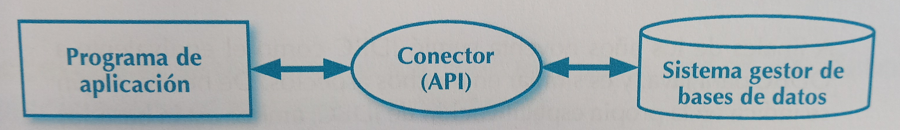
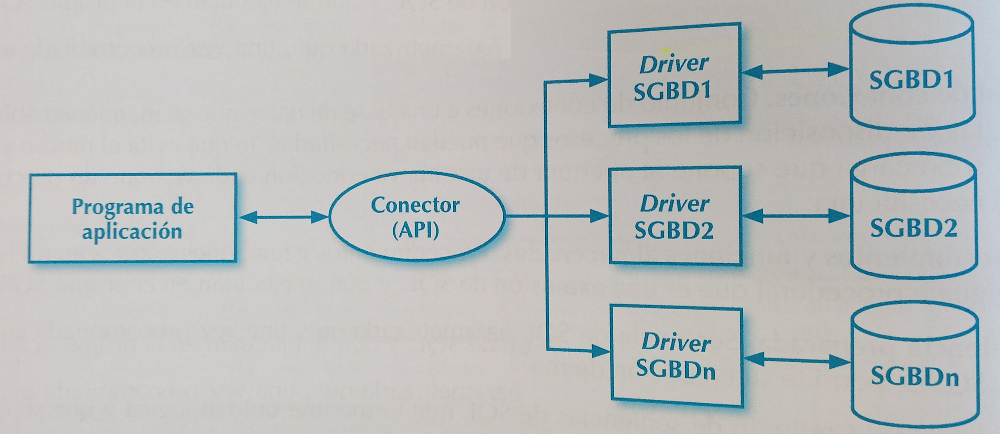

# 3. Datu Base Relazionalak

**Helburuak**:
- Konektoreek ematen dituzten **API**ak ezagutzea, batez ere **JDBC**renak (*Java Database Connectivity*) datu base erlazionaletarako.
- Datu base batera konekzioa irekitzea JDBCrekin bere *driver*rak erabiliz.
- Java programak garatzea JDBC erabiliz SQL sententziak exekutatzeko. Datuen definizioa (**DDL**) eta datuan modifikazio eta kontsultarako (**DML**).
- Trantsakzioekin lan egitea

### 3.1 Konektoreak
Konektorea API bat da, aplikazio-programei datu-baseekin lan egiteko aukera ematen diena. 

Hainbat motatako datu-baseak kudeatzeko sistemek (DBKS) beren lengoaia espezializatuak dituzte biltegiratzen dituzten datuekin jarduteko. Aldiz, aplikazio-programak helburu orokorreko programazio-lengoaiekin idazten dira, adibidez, Javaz. Aplikazio-programek eta DBKS elkarreragin ahal izateko, mekanismoak behar dira, aplikazio-programek lengoaia horietan datu-baseekin komunikatzeko aukera izan dezaten. Horiek APIan inplementatzen dira eta ***konektore*** deitzen dira.



### 3.2 Datu base erlazionaletarako konektoreak

SQL lengoaia estandarra da. Baina datu-base erlazional desberdin asko daude, eta bakoitzak bere SQL bertsioa du, bere berezitasunekin.

*Driver*rak erabiliz arkitektura generiko bat gara daiteke, non konektoreak intefaze komun bat duen aplikazioetarako zein datu-base desberdinetarako, eta driverrak datu-base desberdinen berezitasunez arduratzen dira.



Horrela, konektorea ez da API sinple bat bakarrik, arkitektura bat baizik, *driver* desberdinek datu-base partikularretara sartzeko inplementatu behar dituzten interfaze batzuk zehazten dituelako. Lehenengoa ODBC (Open DataBase Connectivity) izan zen, Microsoftek 90. hamarkadaren hasieran garatua.

Datu-base garrantzitsu guztiek ODBCren eta JDBCren driverrak eskaintzen dituzte gaur egun.

Driverretan oinarritutako konektoreek ematen duten abantailek (batez ere, datu basearekiko independentzia), konplexutasuna dakar.

### 3.3 Datu-base erlazionaletako kontsulten emaitzetarako sarbidea, konektoreen bidez

Konektoreek datu-base erlazional baten gainean era guztietako eragiketak egiteko aukera ematen dute. Atal honetan kontsultei erreparatuko diegu.

Datu-base erlazionaletan, informazioaren biltegiratzea **taula** da. Taula bakoitzak **zutabe-multzo finko bat** du, **datu mota jakin batekin**. SQL kontsulta batek lerroak edo *recordset* multzo bat itzultzen du. Konektoreek aukera ematen dute emaitza horiek lerroz lerro berreskuratzeko, *iteratzaile* edo kurtsore gisa jarduten duen objektu baten bidez.

```java
Connection c = getConnection(konexio datuak);
Statement s = c.createStatement();
ResultSet rs = s.executeQuery("SELECT...");
while(rs.next()) { //rs-n kontsultako emaitza gehiago daude
    String datu1 = rs.getString(1); //Lehen zutabeko Stringa hartu
    int datu2 = rs.getInt(2); //Bigarren zutabeko integerra hartu
}
s.close();
c.close();
```

### 3.4 Objektu-erlazioal desfasea

Aurreko puntuan ikusi dugunaren alderantzizkoa egitea, hau da, memorian dauzkagun aldagaien datuak datu basean gordetzea, **zailagoa da**. Batez ere, objektuekin lanean gabiltzanean. Objektu konplexuen bilduma batek grafo-egitura du, eta ez da erraza informazio hori errenkadak eta zutabeak dituzten tauletan biltegiratzea. **Zailtasun guzti hauen multzoari objektu-erlazional desfasea deritzo**.

Objektu konplexuak gordetzeko 2 aukera ditugu: bata objektuen datu base bat erabiltzea da eta bestea, **ORM** (objektu-erlazionak korrespondentzia) tresnak erabiltzea.

### 3.5 Java Database Connectivity

Javarako JDBC konektoreen arkitektura *driver*-etan oinarrituta dago eta bere APIa <code>java.sql</code> paketean dago eskuragarri. 

### 3.6 Oinarrizko eragiketak JDBCn

Oinarrizko SQL sententziak exekutatu daitezke. **DML** (*Data Manipulation Language*) eta **DDL** (*Data Definition Language*).

* Kontsultak (<code>SELECT</code>) <code>executeQuery()</code> funtzioaren bidez egiten dira eta <code>ResultSet</code> bat itzultzen du zeinetan lerro bat edo batzuk egongo diren, guk *iteratu* ditzakegunak.

* Gainontzeko DML sententziak (<code>UPDATE, DELETE, INSERT</code>) <code>executeUpdate</code> bidez exekutatzen dira, zeinek eragindako lerro kopurua itzultzen dituen.

* DDL sentzentzuak <code>execute()</code> bidez exekutatzen dira.

Datu-base batekin jarduteko, beharrezko kontsultak eginda, gure aplikazioak honako hau egin beharko du:

1) Datu-base horrek erabiltzen duen protokoloa ulertzeko beharrezkoa den driverra kargatzea.
2) Datu-basearekiko konexioa ezartzea.
3) SQL kontsultak bidali eta emaitza prozesatu.
4) Baliabideak askatzea amaitzean.
5) Gerta daitezkeen akatsak kudeatzea


Honako sententzia-mota hauek erabil ditzakegu:

<code>Statement</code>: SQLko sententzia errazetarako.

<code>PreparedStatement</code>: prestatutako kontsultetarako, adibidez parametroak dituztenetarako.

<code>CallableStatement</code>: datu-basean biltegiratutako prozedurak gauzatzeko.

#### 3.6.1 Konexioak irekitzea eta zarratzea
JDBCren *driver*rak eskuragarri daude <code>.jar</code>ean. <code>DriverManager</code> bidez konexioa ezar daiteke <code>getConnection(String konexio_URL)</code> metodoa erabiz.

<code>konexio_URL</code>ari dagokionez, konexioa ezartzeko beharrezko informazioa eduki behar du. Adibidez MySQL datu base batera konektatzeko, itxura hau izango du: <code>jdbc:mysql:host:portua/DatuBasea</code> non *host* IP bat izan daitekeen edota localhost datu basea geure makinan badago. MySQLn defektuzko portua 3306 da.

*driver*ak konexioa ondo burutzen badu, <code>Connection</code> objektu bat itzultzen du, zein datu basearekin egingo ditugun eragiketa guztiez arduratuko den.

Gogoratu datu basearekin egiten ditugun eragiketek salbuespenak sor ditzatela eta beraz, hauek kudeatu behar ditugula <code>try-catch</code> blokeen bidez. Salbuespen orokorrez aparte, <code>SQLException</code> salbuespenak sor ditzakete.

Ikusi [JDBC konexio adibidea](/adibideak/02-Konektoreak/JDBC_konexioa.java).

#### 3.6.2 Statement interfazea
<code>Statement</code> interfazea edozein motatako SQL sententzia exekutatzeko erabiltzen da. Objektu hau eskuratu daiteke <code>Connection</code> objektuaren <code>getStatement()</code> metodoa erabiliz. 

[Statement-en informazioa gehiago](https://docs.oracle.com/javase/tutorial/jdbc/basics/processingsqlstatements.html)

#### 3.6.3 DDL sententzien exekuzioa
**DDL**k (*Data Definition Language*) taulak, bistak eta datu-base erlazional batean egon daitezkeen gainerako objektuak sortzeko, aldatzeko eta ezabatzeko sententziak biltzen ditu. <code>execute()</code> metodoaren bidez exekutatzen da.

#### 3.6.4 Datu-basearen edukiak aldatzeko sententziak
Sententzia hauek <code>executeUpdate()</code> metodoarekin exekutatzen dira, zeinek eragina izan duten lerro kopurua itzuliko duen. <code>INSERT</code>, <code>UPDATE</code> edo <code>DELETE</code> sententzietan erabiltzen da.

#### 3.6.5