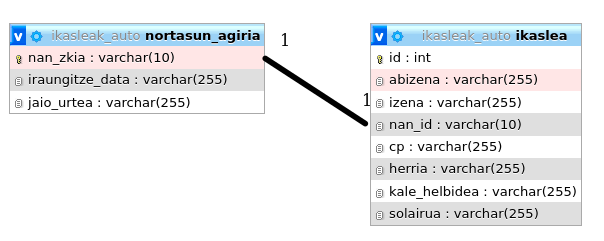
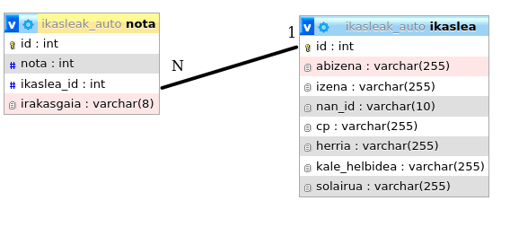
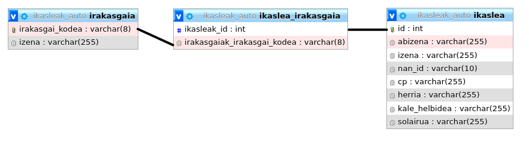

# 4. Mapaketa Objektu-Erlazioanala (ORM)

ORM tresnek objektuak datu base erlazionaletan gordetzea ahalbideratzen dute. Objektuei orientatutako programazio (OOP) lengoaia batean programatzen badugu, Javaz esaterako, objektuen instantziak erabiliko dugu. Maneiatzen ditugun objektu hauek datu base erlazional batean gorde behar badira, objektuen konplexutasunaren arabehera arazoak izan ditzakegu. Nola gorde objektu bat beste objektu baten instantzien zerrenda bat daukanean, eta bigarren objektu honek bere barnean hainbat atributu multibaluatu baditu? **Ondo pentsatu beharko genuke zeintzuk INSERT egin behar diren, eta ze ordenatan integritate murriztapenak betetzeko.**

**ORM tresnek** abstrakzio kapa bat gehitzen dute eta aipatutako arazoaren konponbide dira. Taula erlazionaletan pentsatu beharrik izan gabe gorde ditzakegu objektuak, **bera arduratuko da eta taulen kudeaketaz**.

# 4 Hibernate ORM
Unitate hau lantzeko, [**Eclipse**](https://www.eclipse.org)n [**Maven**](https://maven.apache.org/) proiektuak erabiliko ditugu, dependentzien kudeaketa errazagoa egiteko. Dependentziak **pom.xml** fitxategian jarriko ditugu eta berak automatikoki deskargatuko ditu dagozkien *.jar* fitxategiak. Dependentzia eguneratuak bilatzeko, [MVN Repository](https://mvnrepository.com/).


## 4.1 Dependentziak

Gure proiektuetan, gutxienez 2 dependentzia hauek gehituko ditugu (Hibernate ORM + MySQL connector). Adibide honetan MySQL erabiliko dugulako, baina beste datu base kudeatzaile bat erabili daiteke (H2, uCanAccess...).

```xml
<dependencies>
    <dependency>
  		<groupId>org.hibernate</groupId>
  		<artifactId>hibernate-core</artifactId>
  		<version>5.4.24.Final</version>
  	</dependency>
  	<dependency>
        <groupId>mysql</groupId>
        <artifactId>mysql-connector-java</artifactId>
        <version>8.0.22</version>
    </dependency>
</dependencies>
```

## 4.2 Hibernate eta JPA (Java Persistence API)

Hibernatek Java klaseetan anotazio batzun bidez gure datu base erlazionaleko mapaketa egitea ahalbideratzen digu.

Informazio gehiagorako, kontsultatu [**Hibernate ORM User Guide**](https://docs.jboss.org/hibernate/orm/6.3/userguide/html_single/Hibernate_User_Guide.html).

## 4.3 Hibernateren Arkitektura

<p align="center">

</p>


## 4.4 Hibernate.cfg.xml
Hibernate Java proiektua datu base kudeatzailearekin lotu behar dugu. [**Hibernate.cfg.xml**](/klaseko_ariketak/3-ORMHibernate/mvn_hib_ikaslea/src/main/java/hibernate.cfg.xml) konfigurazio fitxategian egiten da hau. Esan behar zaio zein den DB konektorea, zein den konexioaren URLa, datu baseko erabiltzaile eta pasahitza... hau guztia **\<session-factory>** XML etiketaren barruan.

Badago aipagarria den propietate bat, *hibernate.hbm2ddl.auto* dena. Hau "update" jartzen badugu, datu baseko taulak automatikoki sortu/eguneratuko ditu, guk Java klaseetan egindako konfigurazioekin. Garapen inguruneetarako oso erabilgarria.
```xml
<!DOCTYPE hibernate-configuration PUBLIC
        "-//Hibernate/Hibernate Configuration DTD 3.0//EN"
        "http://www.hibernate.org/dtd/hibernate-configuration-3.0.dtd">

<hibernate-configuration>

    <session-factory>

        <!-- JDBC Database connection settings -->
        <property name="connection.driver_class">com.mysql.cj.jdbc.Driver</property>
        <property name="connection.url">jdbc:mysql://localhost:3306/ikasleak_auto?useSSL=false&amp;serverTimezone=UTC</property>
        <property name="connection.username">root</property>
        <property name="connection.password"></property>

        <!-- JDBC connection pool settings ... using built-in test pool -->
        <property name="connection.pool_size">1</property>

        <!-- Select our SQL dialect -->
        <property name="dialect">org.hibernate.dialect.MySQL5Dialect</property>

        <!-- Echo the SQL to stdout -->
        <property name="show_sql">true</property>

		<!-- Set the current session context -->
		<property name="current_session_context_class">thread</property>
		
		<!-- Sortu taulak, if doesn't exit -->
		<property name="hibernate.hbm2ddl.auto">update</property>

 
    </session-factory>

</hibernate-configuration>
```

## 4.5 Mapaketa anotazioak

Java klaseak eta hauen atributuak DB erlazionaletako taulekin lotu behar ditugu. Kasurik errezena, inongo erlaziorik ez daukan entitatea izango da, taula isolatu bakarra izango delako.

### 4.5.1 @Entity eta @Table

Taula batean gordeko ditugun Java klaseek **@Entity** anotazioa izan behar dute eta aukera daukagu **@Table** anotazioa jartzeko DBKSan taularen izena definitzeko. 

Java klase guztien EZ dute derrigorrez @Entity eduki behar.

Hibernateko aurreko bertsioetan javax-etik inportatzen ziren, baina bertsio berrietan **jakarta**-tik egiten dira inportazioak.

```java
import jakarta.persistence.Entity;
import jakarta.persistence.Table;

@Entity
@Table(name="ikaslea")
public class Ikaslea {
    //...
}
```
Aurreko adibidean "*Ikaslea*" izeneko Java klase bat daukagu zein MySQLko "*ikaslea*" taularekin mapeatuta dagoen.

### 4.5.2 @Column
Java klaseko atributuak tauletako zutabeekin lotzen dira. Hau egiteko **atributuei @Column anotazioa** jartzen zaie. Anotazio honi "*name*" parametroa jarri dakioke zutabearen izena definitzeko.

```java
//...
import jakarta.persistence.Column;

@Entity
@Table(name="ikaslea")
public class Ikaslea {
    //...

	@Column(name="jaioterria")
	private int jaio_herria;

    //...
}
```

### 4.5.3 @Id eta @GeneratedValue
Anotazio hauek **Java klaseko atributuetan** jartzen dira.

DB erlazionaletako tauletan Primary Key bat egon behar du eta **Hibernaten primary key hau @Id anotazioarekin** definitzen da.

Sarritan *Primary Key*a automatikoki sortzen da. Gure helburua hau bada, orduan **@GeneratedValue** anotazioa gehituko diogu klaseko atributuari.

```java
//...
import jakarta.persistence.Id;
import jakarta.persistence.GeneratedValue;
import jakarta.persistence.GenerationType;

@Entity
@Table(name="ikaslea")
public class Ikaslea {

    @Id
	@GeneratedValue(strategy=GenerationType.IDENTITY) 
	@Column(name="id")
	private int id;

    //...
}
```

### 4.5.4 Eraikitzailea, Getters & Setters

Klaseko atributuek getter/setterrak behar dituzte (IDE gehienek automatikoki sortzeko aginduak dituzte) eta baita **eraikitzaile huts** bat ere. Parametrodun eraikitzaile bat izan dezakegu gutxieneko atributuak ezartzeko, baina beharrezkoa da eraikitzaile hutsa ere egotea.

```java
@Entity
@Table(name="ikaslea")
public class Ikaslea {
    //...

    public Ikaslea(){
    }

    //...
    //getters/Setters
}
``` 

### 4.5.5 Entitateen arteko erlazioak

#### 4.5.5.1 @OneToOne
Bi entitaren arteko 1-1 erlazioa egiteko erabiltzen da anotazio hau.
Adibidez, pertsona batek NAN bakarra dauka eta NAN bat pertsona bakarrarena da:
<p align="center">

</p>

DB erlazionaletan, badakigu 2 taula direla eta **bietako batek** bestearen IDa (foreign key-a) izango zuela. Aurreko adibidean, "ikaslea" taulan gordetzen da "nortasun_agiriaren" IDa.

Lotura hau (mapaketa), **@JoinColumn** bidez egiten da. Hau da, bi klaseetako bakarrean egin behar dugu mapaketa (beste taularen datua gordeko duen taulan).

[@OneToOne](https://docs.jboss.org/hibernate/orm/6.3/userguide/html_single/Hibernate_User_Guide.html#associations-one-to-one) anotazioan, parametroak pasa ditzakegu. Erabiliena "*cascade*" izan daiteke, 2 taulak nolabait sinkronizatuta mantentzeko. Adibidez, ikasle bat ezabatzean bere NANa ere ezabatzea nahi dugu, edo ikasle bat sortzean automatikoki nan-a ere sortzea nahi dugu... Cascade mota ezberdinak daude, sortzerako, ezabatzeko, eguneratzeko... edo guztietarako.

```java
@Entity
@Table(name="ikaslea")
public class Ikaslea {
    //...

    @OneToOne(cascade=CascadeType.ALL)
	@JoinColumn(name = "nan_id")
	private NortasunAgiria nan;
    //...
}
``` 

Aurreko adibidearekin, ikasle batetik bere NANa atzitu dezakegu, baina alderantziz ez. Bidirekzionala izatea nahi badugu, NAN klasean ere "ikaslea" atributua sortu beharko dugu (**baina ez @Column anotazioa erabiliz, benetan taula erlazionalean ez delako zutabe bat!**)

Hemen garrantsitzuena "*mappedBy*" jartzea da. Honek esan nahi du beste klasean egin dugula @JoinColumn mapaketa.

```java
@Entity
@Table(name="nortasun_agiria")
public class NortasunAgiria {
    //...

    @OneToOne(
			mappedBy = "nan",
			cascade = CascadeType.ALL,
			orphanRemoval = true,
			fetch = FetchType.LAZY
		)
	private Ikaslea ikaslea;
    //...
}
``` 
Konfigurazio honekin, ikasle batetik bere NANa atzitu dezakegu eta alderantziz ere bai.


#### 4.5.5.2 @ManyToOne eta @OneToMany

Anotazio hauek 1-N motako erlazioak egiteko da.

Adibidez, ikasle batek nota asko ditu, baina nota bat ikasle bakarrarena da:

<p align="center">

</p>

Aurreko adibideko konfigurazioa egiteko...:
* *Ikaslea* klasean @OneToMany anotazioa erabiliko dugu
* *Nota* klaseak @ManyToOne anotazioa erabiliko dugu

Nola jakin ze anotazio ze klasetan jarri? Ba anotazioko lehen hitzak esango digu:
* One **ikasle** to Many nota (**ikaslea**n OneToMany)
* Many **nota** to One ikasle (**nota**n ManyToOne)

Kasu honetan ez dugu @JoinColumn anotazioaren beharrik. Inplizituki egiten du @ManyToOne anotazioak. 1-N erlazioetan Foreign Keya beti gordetzen delako "N" aldean.
```java
@Entity
@Table(name="nota")
public class Nota {
    //...

    @ManyToOne
	private Ikaslea ikaslea;
    //...
}
``` 

```java
@Entity
@Table(name="ikaslea")
public class Ikaslea {
    //...

    @OneToMany(mappedBy = "ikaslea", cascade = CascadeType.ALL, orphanRemoval = true)
	private List<Nota> notak = new ArrayList<>();
    //...
}
``` 

#### 4.5.5.3 @ManyToMany
N-M erlazioak egiteko erabiltzen da @ManyToMany anotazioa.
Adibidez, ikasle batek irakasgai asko ditu, eta irakasgai batean ikasle asko daude. Badakigu, DB erlazionaletan kasu hauetan taula bitartekari bat sortzen dela, honela:

<p align="center">

</p>

Guretzako Hibernaten hau transparentea da, ez dugu jakin behar nola funtzionatzen duten taulek. 

```java
@Entity
@Table(name="ikaslea")
public class Ikaslea {
    //...

    @ManyToMany(cascade = {CascadeType.PERSIST, CascadeType.MERGE})
	private List<Irakasgaia> irakasgaiak = new ArrayList<>();
    //...
}
``` 

```java
@Entity
@Table(name="irakasgaia")
public class Irakasgaia {
    //...

    @ManyToMany(mappedBy = "irakasgaiak")
	private List<Ikaslea> ikasleak = new ArrayList<>();
    //...
}
``` 

Ikusi konfigurazio orokorra [adibide orokorreko Entity paketean](/klaseko_ariketak/3-ORMHibernate/mvn_hib_ikaslea/src/main/java/entitateak/).

### 4.5.6 @Embeddable eta @Embedded
Baliteke taula askotan zutabe asko berdinak izatea, adibidez, "ikaslea", "irakaslea", "enpresa"... tauletan helbide datuak egotea. Hibernateren bidez, kode asko aurreztu dezakegu "helbide" hori aparteko Java klase batean jarriz (ez @Entity motakoa, baizik eta @Embeddable motakoa).

```java
@Embeddable
public class Helbidea {
	
	private String herria;
	private String cp;
	private String kale_helbidea;
	private String solairua;
	
	public Helbidea() {}
    //...
}
```
Lau atributu horiek guk nahi dutugun taula/entitateetan erabil ditzakegu. Tauletan 4 zutabe hauek gehituko dira.

```java
@Entity
@Table(name="ikaslea")
public class Ikaslea {
    //...
    @Embedded
	private Helbidea helbidea;
    //...
}
```
Honen emaitza ikusteko, joan [aurreko irudiko aribidera](#adb1)

### 4.5.7 @ElementCollection
ER diagraman, atributu multibaluatuak jarri ditzakegu, zirkulu bikoitza erabiliz. Sarritan atributu multibaluatu hau "telefonoa" izaten da, adibidez, pertsona batek telefono bat edo gehiago izan ditzakeelako. Telefonoak berak ez dauka nahiko informazio entitate bat izateko. Nola egiten da hau DB erlazionalean? Beste taula bat sortuz telefonoak eta entitate nagusiaren IDa gordeko duena:
```java
@ElementCollection
private Collection<String> phones = new ArrayList<>();
```
String dakarren tokian, **@Embeddable** motako klase bat ere jarri daiteke.
## 4.6 SessionFactory eta Session
Hibernate erabiltzeko main-ean Session bat sortu behar dugu, horretarako, lehendabizi beste objektu batzuk sortu behar dira. Honela da hierarkia:

* **StandardServiceRegistry** sortu. Hemen adierazi zein den hibernate konfigurazio fitxategia.
* **Metadata** sortu. Hemen adierazi erabiliko dituzun Java klaseak. Kontutan izan klase batek beste klase bateko lotura badauka, bigarren hau ere adierazi beharko dela.
* **SessionFactory** sortu
* **Session** sortu. Ikusi [*Session*en dokumentazioa](https://docs.jboss.org/hibernate/orm/3.5/api/org/hibernate/Session.html).

```java
public static void main(String[] args) {
		StandardServiceRegistry standardRegistry = new StandardServiceRegistryBuilder()
				.configure( "hibernate.cfg.xml" )
			    .build();

		Metadata metadata = new MetadataSources( standardRegistry )
				.addAnnotatedClass( Irakasgaia.class )
				.addAnnotatedClass( Ikaslea.class )
				.addAnnotatedClass( NortasunAgiria.class )
				.addAnnotatedClass( Nota.class )
			    .getMetadataBuilder()
			    .build();

		SessionFactory sessionFactory = metadata.getSessionFactoryBuilder()
				.build();    
		
		Session session = sessionFactory.openSession();
		
		try {			
            //... Gure programa
        } catch (Exception e) {
            //...
        }
}
```

### 4.6.1 Transakzioak

Komeni da transakzioak erabiltzea, klase baten instantzia bat datu basean gordetzean baliteke hainbat taulei eragina izatea eta.

```java
System.out.println("Irakasgaia sortzen...");
Irakasgaia irakasgaia = new Irakasgaia("DA", "Datu Atzipena");

session.beginTransaction(); //Transakzio hasiera

System.out.println("Gorde irakasgaia");
session.persist(irakasgaia);

session.getTransaction().commit(); //Transakzio bukaera
System.out.println("Eginda!");
```

### 4.6.2 Session objektuaren funtzio erabilienak
Session objektuak CRUD funtzioak inplementatuta ditu (Create, Read, Update eta Delete).
* Gordetzeko **.persist(Object object)**
* Bat jasotzeko **.get(Class clazz, Serializable id)**
* Ezabatzeko **.delete(Object object)**
* Eguneratzeko **.update(Object object)**
* ...dokumentazioan gehiago.
