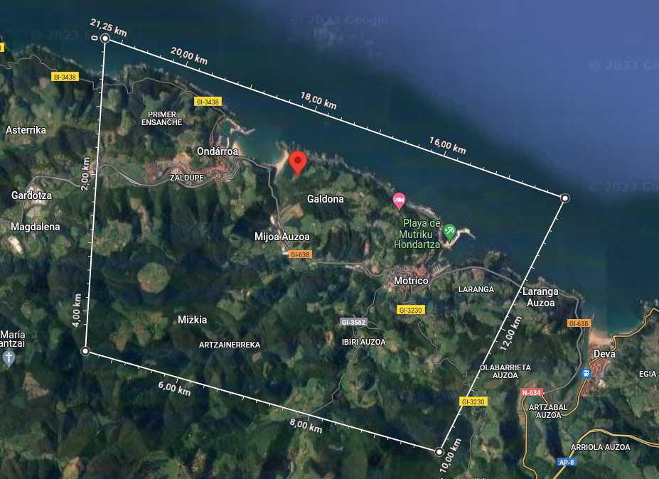

# 6. NoSQL (*Not Only SQL*)

## 6.1 Lehen pausuak

Instalatu [MongoDB](https://www.mongodb.com/try/download/community) eta [MongoCompass](https://www.mongodb.com/products/tools/compass) (GUI).

## 6.2 MongoDB Queryak:
[Query Dokumentazio ofiziala](https://www.mongodb.com/docs/manual/tutorial/query-documents/).

```mongosh
db.createCollection("new_collection")

db.COLLECTION.insertOne(DOCUMENT) //_id automatiko, edo eskuz

db.instrumentuak.find({"mota": { $in: ["haizezkoa", "Soka"]}})

//WHERE ... AND ...
db.instrumentuak.find({"mota": { $in: ["haizezkoa", "Soka"]}, "prezioa": {$eq: 500}})

//WHERE ... OR ...
db.instrumentuak.find({$or: [ 
							{"mota": { $in: ["haizezkoa", "Soka"]}}, 
							{"prezioa": {$eq: 700}}
							]
						})
						
						
						
//UPDATE
db.instrumentuak.updateOne({_id:"hodei"}, {$set: {"izena":"pianoa2"}})

//DELETE
db.instrumentuak.deleteOne({"_id":"hodei"})
db.instrumentuak.deleteMany({"mota": {$in: ["haizezkoa", "soka"]}})
```

## 6.3 Eclipsetik MongoDB atzitu

MongoDB SpringBoot aplikaziotik ere erabil daiteke, baina unitate honetan, errazago egiteko, Maven proiektu soil bat erabiliko da.

Mavenen [MongoDBko dependentzia](https://mvnrepository.com/artifact/org.mongodb/mongodb-driver-sync) gehitu behar dugu.

Behin hori eginda, hasierako froga bat egin dezakegu.

[Hemen dago dokumentazio guztia, adibideekin](https://www.mongodb.com/docs/drivers/java/sync/current/quick-start/).

```java
import static com.mongodb.client.model.Filters.eq;
import org.bson.Document;
import com.mongodb.client.MongoClient;
import com.mongodb.client.MongoClients;
import com.mongodb.client.MongoCollection;
import com.mongodb.client.MongoDatabase;
public class QuickStart {
    public static void main( String[] args ) {
        // Zure konexio Stringa jarri. Adib: "mongodb://localhost:27017"
        String uri = "<connection string uri>";
        try (MongoClient mongoClient = MongoClients.create(uri)) {
            MongoDatabase database = mongoClient.getDatabase("zure_db_izena");
            MongoCollection<Document> collection = database.getCollection("zure_kolekzioa");
			//Bilatu "title" "John Doe" duten dokumentuak
            Document doc = collection.find(eq("title", "John Doe")).first();
            if (doc != null) {
                System.out.println(doc.toJson());
            } else {
                System.out.println("No matching documents found.");
            }
        }
    }
}
```


## 6.4 GeoSpatial queries

[Dokumentazio ofiziala](https://www.mongodb.com/docs/manual/geospatial-queries/).

Erabiliko ditugun JSON dokumentuak **GEOJSON** motakoak izango dira. Datuak [OpenData Euskaditik](https://opendata.euskadi.eus/hasiera/) jaso ditzakegu.

GEOJSON dokumentu baten adibidea (ikusi "*geometry*" dokumentua daukala bere barnean):
```
[ {
    "id" : 1,
    "type" : "Feature",
    "geometry" : {
      "type" : "Point",
      "coordinates" : [ -2.927723, 43.2624787 ]
    },
    "properties" : {
      "documentname" : "ABANDO",
      "documentdescription" : "Guztiz zaharberritutako eraikin moderno batean dagoen lau izarreko hotel honek dekorazio abangoar...",
      "templatetype" : "Ostatuak",
      "country" : "España",
      "marks" : "Bilbao",
      "physical" : "Egokia aniztasun funtzional fisikoa duten pertsonentzat",
      "visual" : "Egokia ikusmeneko aniztasun funtzionala duten pertsonentzat",
      "auditive" : "Egokia entzumeneko aniztasun funtzionala duten pertsonentzat",
      "intellectual" : "Egokituta adimeneko aniztasun funtzionala duten pertsonentzat",
      "organic" : "Egokitua aniztasun funtzional organikoa duten pertsonentzat",
      "tourismemail" : "abando@aranzazu-hoteles.com",
      "web" : "https://www.aranzazu-hoteles.com/",
      "lodgingtype" : "Hotelak",
      "category" : "4",
      "room" : "1",
      "signatura" : "HBI01056",
      "capacity" : "259",
      "store" : "1",
      "municipality" : "Bilbao",
      "municipalitycode" : "020",
      "territory" : "Bizkaia",
      "territorycode" : "48",
      "countrycode" : "108",
      "friendlyurl" : "https://turismoa.euskadi.eus/eu/ostatuak/abando-hotela/aa30-12375/eu/",
      "physicalurl" : "https://turismoa.euskadi.eus/aa30-12375/eu/contenidos/a_alojamiento/0000000005_a1_rec_turismo/eu_5/5-ficha2.html",
      "dataxml" : "https://turismoa.euskadi.eus/contenidos/a_alojamiento/0000000005_a1_rec_turismo/eu_5/data/5_openData.xml",
      "metadataxml" : "https://turismoa.euskadi.eus/contenidos/a_alojamiento/0000000005_a1_rec_turismo/r01Index/0000000005_a1_rec_turismo-idxContent.xml",
      "zipfile" : "https://turismoa.euskadi.eus/contenidos/a_alojamiento/0000000005_a1_rec_turismo/opendata/0000000005_a1_rec_turismo.zip"
    }
  }, 
  ...
  ]
```
### $near (hurbiltasunagatik bilatu)
Lehenbabizi *index edo indize* bat sortu behar dugu **geometry** dokumentuekiko, bilaketak hauen bidez egingo direlako. 

```
db.COLLECTION.createIndex({geometry: "2dsphere"})
db.kanpinak.find({geometry:{$near:{$geometry:{type: "Point", coordinates: [-2.4203279,43.3211948]},$maxDistance:1000}}}).count()
```


### $geoWithin (eremu barruan bilatu)

Bilatu eremu honetan:



4 puntu sortuko ditugu, bilaketan, lehen eta azken puntua, puntu bera izan behar dute.
```
p1 = [-2.434813468508409, 43.334478736696035]
p2 = [-2.4376489364561156, 43.302827294032724]
p3 = [-2.4053246018522607, 43.29528038271553]
p4= [-2.3530709782445247, 43.308545813855275]
db.kanpinak.find({geometry:{$geoWithin:{$geometry:{type:"Polygon", coordinates:[[p1,p2,p3,p4,p1]]}}}})
``` 