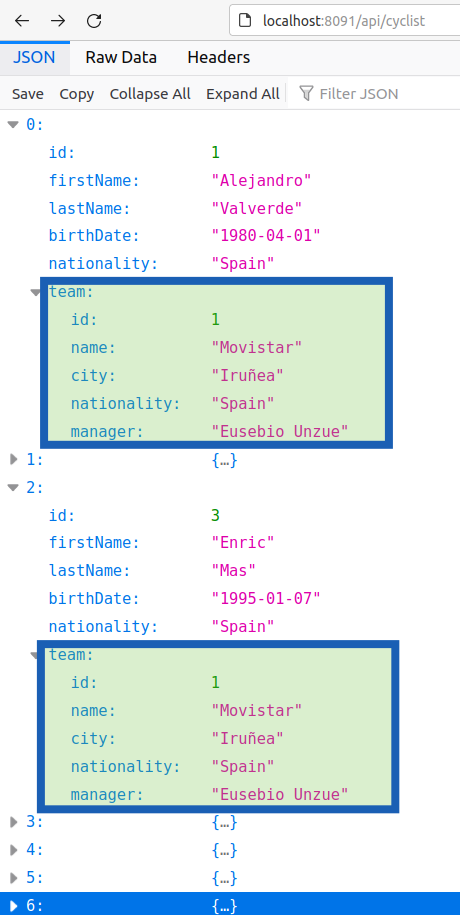

# 7. API REST


## 7.1 Sarrera

API edo "*Application Programming Interface*" (Aplikazio Programazio Interfazea) informatikan erabilera berezia duten **programen artean komunikatzeko** erabiliko den interfazea da. API-ak aplikazio batzuk beste aplikazioekin komunikatzeko modu bat ematen du, hau da, informazioa edo funtzionalitatea partekatzen dute. API-ak erabilera estandarrean, programazio lengoaietan (Java, Python, Ruby, etab.) idatzita daude eta web zerbitzuak, sistema eragileak edo aplikazio berriak bezalako erakundeak eskuragarri dauden funtzioak eskaintzen dituzte.

API-ak hainbat erabilera izan ditzakete, baina hainbat mota desberdinak izan ditzakete ere. Hemen dituzun batzuk:

- **Web API**: HTTP edo HTTPS protokoloa erabiliz web zerbitzuetatik informazioa eskuratzeko edo bidaltzeko erabil daitezkeen API-ak dira. RESTful edo GraphQL protokoloak erabil daitezke web API-en diseinuan.

- **Library API**: Programazio lengoaiak erabiliz, programatzaileek liburutegi batzuk erabil ditzaten moduan interfazea eskaintzen dutenak.

- **Operating System API**: Sistema eragilearen funtzioak erabiltzen dituzten aplikazioekin komunikatzeko erabil daitezkeen interfazeak

- **Database API**: Datu-base sistema batetik informazioa eskuratzeko edo gordetzeko erabiltzen diren interfazeak.

## 7.2 API REST
API REST edo *Representational State Transfer* API, **web zerbitzuetan erabiltzeko diseinu estandarra da. Hau da, web aplikazioek elkarrekin komunikatzeko erabil daitekeen interfazea. REST protokoloak HTTP edo HTTPS erabiliz lan egiten du, eta hainbat aplikazioekin komunikazioa erraztu egiten du.


- **Errepresentazioa** (Representation): REST-ek errepresentazio bat bidaltzen du, hau da, informazioa JSON, XML edo beste formatu batzuetan. Komunikazioa erabilgarri eta zuzena egiten du, eta formatu horiek erabilgarriak dira hainbat programazio lengoaietan.

- **Egoera** (Stateless): REST-ek egoeraik gabeko sistema bat eraikitzen du. Eskaerek, aurretik egindako eskaerak edo egoerak ez ditu gogoratzen.

- **Baliabideen Kudeaketa** (Resource Management): REST-ek baliabideak kudeatzea errazten du.

- **HTTP Metodoak**: REST-ek HTTP metodo estandarrak erabiliz funtzionatzen du. Hauek dira gehien erabilitakoak:

    * GET: Informazioa eskuratzea.
    * POST: Baliabide berria sortzea.
    * PUT: Baliabide bat edo gehiago eguneratzea.
    * DELETE: Baliabide bat ezabatzea.

Eskaera jakin bat egiten denean, oso garrantzitsua da jakitea eragiketa hori behar bezala egin den edo, aitzitik, akatsen bat gertatu den. Horretarako, HTTP webguneak errore/arrakasta kode ugari ditu, API REST bat erabiliz baliabide bat manipulatzen saiatzen denean erabiltzaileak jaso ditzakeen erantzun posible guztiak estaltzen dituztenak.

Hauek dira ohikoenak:

* **200 OK**. Erantzun estandarra eskaera zuzenetarako.
* **201 Created**. Eskaera osatu egin da eta errekurtso berri bat sortu da.
* **202 Accepted**. Eskaera onartu da prozesatzeko, baina ez da bete.
* **400 Bad Request**. Eskabidean okerreko sintaxia dago.
* **403 Forbidden**. Eskaera legezkoa izan zen, baina zerbitzariak uko egin dio erantzuteari, bezeroak ez baitu hori egiteko pribilegiorik.
* **404 Not Found**. Baliabidea ez da aurkitu. Web zerbitzariak eskatutako orria edo baliabidea aurkitzen ez duenean erabiltzen da.
* **500 Barneko Server Error**. Web zerbitzarietan sartutako aplikazioek ematen duten kode bat da, web zerbitzariaren izaerarekin zerikusirik ez duten errore-egoerekin topo egiten dutenean.


## 7.3 Autentifikazioa
API bati anonimoki deia egin daiteke, hau da, autentifikazioa egin gabe, baina hainbat faktoreengatik, API bat sarbide kontrola inplementatu beharko du. Hemen daude sarbide kontrola kudeatzeko zenbaki batzuk:

- **API Key**: APIa erabiliko denean, beste erabilzaileek identifikatzea errazten duen gako bat eskatzeko modua da. API keya erabiliz, zerbitzariak zein aplikazioak erabiliko duten erabilzailea identifikatu egiten da. Hala ere, API keyak gutxitu egin daitezke, hainbat segurtasun egitasmo erabiliz (SSL/TLS erabiliz, tokenak erabiliz, etab.).

- **Token-Based Authentication**: Erabilzailea autentifikatzeko, tokenak erabil daitezke. Erabilzaileak erabiltzaile eta pasahitza ematen ditu, eta sistema honek token bat sortzen du, hau da, identifikatzaile bakarra. Tokena erabiliz, erabilzaileak identifikatzen dira. OAuth protokoloa ere erabil daiteke tokenak baliatzeko.

- **OAUTH (Open Authorization)**: OAUTH protokoloak erabiltzaileak aplikazioei eskubideak ematen dizkie, baina hainbat etapa ditu autentifikazio prozesuan. Aplikazioak token bat jasoko du erabilzailearen izenean eta horrekin erabilgarriak izango dira token horrek eskubide guztiak dituztenei.

- **IP Whitelisting**: Hainbat API-etak IP helbideak baimendu dezakete, horrela, baimendutako IP helbideetatik bakarrik erabilzaileek sarbidea izango dute.

- **Rate Limiting**: Deiak neurtzen dira denbora-tarte batean edo kopuru batean, hau da, erabilzaileak exedentzia handitzen badu, atzerapenak edo baimendutako kopurua murriztu daitezke.

- **SSL/TLS**: Sarbidea segurutzeko, SSL/TLS erabil daitezke. Hau da, informazioa enkriptatzen da bidalketa prozesuan, hainbat segurtasun arazoren aurka.

## 7.4 Abantailak

API REST bat erabiltzearen abantaila nagusia edozein kontsumitzaileren aurrean ematen duen **independentzia** da, edozein hizkuntza edo plataformarekin sartzen dela ere. Horri esker, API REST bera hamaika bezerok kontsumi dezakete, bezero horien izaera edozein izanik ere, eta beste edozein kontsumitzaile motatara aldatzeak ez du inolako eraginik izango harengan. Ezaugarri horrek **fidagarritasuna, eskalagarritasuna eta eramangarritasun erraza** ematen dizkio beste edozein plataformari, **bezeroa zerbitzaritik erabat isolatzen baitu**. 

Erantzunen informazio-trukea euskarri batean egitea baino ez da eskatzen, normalean **JSON edo XML formatuan**. Bezeroaren eta zerbitzariaren arteko bereizketa horren ondorioz, beste zerbitzari edo datu-base batzuetara modu gardenean migratu daiteke, betiere datuak behar bezala bidaltzen badira. Horrek REST APIak edozein lan-inguruneri ematen dioten malgutasunagatik gehien erabiltzen diren web-arkitekturetako bat bihurtzen ditu, edozein dela ere haien izaera.

## 7.5 Spring Boot-en API Server
Spring Boot-en `@RestController` dekoratzailea erabiliz, klase bat kontrolatzaile gisa markatzen da, HTTP eskaerak kudeatzeko eta JSON formatuko erantzunak bueltatzeko. Decorator hau bi anotazioen funtzionalitatea bateratzen du: `@Controller` eta `@ResponseBody`.

- `@Controller`: Spring MVC-ren kontrolatzaile gisa markatzen du klase bat, hau da, HTTP eskaerak kudeatu ditzakeen.

- `@ResponseBody`: Esan nahi du metodo baten itzulpena zuzenean HTTP erantzunaren gorputzera serializatuko dela, ikuspegi bezala interpretatua ez.

`@RestController`-rekin markatutako klaseko metodoak automatikoki kontrolatzaileak dira, eta metodo horien emaitza zuzenean erantzunaren gorputzera serializatzen da.

Adibide sinple bat:
```java
import org.springframework.web.bind.annotation.GetMapping;
import org.springframework.web.bind.annotation.RestController;

@RestController
public class AdibideController {

    @GetMapping("/kaixo")
    public KaixoResponse kaixo() {
        return new KaixoResponse("Kaixo, mundua!");
    }

    static class KaixoResponse {
        private final String mezua;

        public KaixoResponse(String mezua) {
            this.mezua = mezua;
        }

        public String getMezua() {
            return mezua;
        }
    }
}
```

`curl http://localhost:8080/kaixo`-ren emaitza JSON hau izango litzateke:
```
{
  "mezua": "Kaixo, mundua!"
}
```

### 7.5.1 RestController-en metodo nagusiak
`@RestController`-ekin markatutako Spring Boot kontrolatzaile batek hainbat metodo izan ditzake, zeinen bakoitzak HTTP (**GET, POST, PUT, DELETE**, etab.) eragiketa desberdinak errepresentatu ditzakeen. Metodo hauek datuak datu-base batetik eskuratu, formularioak prozesatu edo datuak JSON formatuan itzuli ditzake.


- Datuak Eskuratzeko **GET**
```java
@GetMapping("/erabiltzaileak")
public List<Erabiltzailea> erabiltzaileakLortu() {
    return erabiltzaileZerbitzua.erabiltzaileakLortu();
}
```

- Baliabideak sortzeko **POST**
```java
@PostMapping("/erabiltzaileak")
public ResponseEntity<String> erabiltzaileaSortu(@RequestBody Erabiltzailea erabiltzaileBerria) {
    erabiltzaileZerbitzua.erabiltzaileaSortu(erabiltzaileBerria);
    return new ResponseEntity<>("Erabiltzailea ongi sortu da", HttpStatus.CREATED);
}
```

- Baliabideak eguneratzeko **PUT**
```java
@PutMapping("/erabiltzaileak/{id}")
public ResponseEntity<String> erabiltzaileaEguneratu(@PathVariable Long id, @RequestBody Erabiltzailea eguneratutakoErabiltzailea) {
    erabiltzaileZerbitzua.erabiltzaileaEguneratu(id, eguneratutakoErabiltzailea);
    return new ResponseEntity<>("Erabiltzailea ongi eguneratu da", HttpStatus.OK);
}
```

- Baliabideak ezabatzeko **DELETE**
```java
@DeleteMapping("/erabiltzaileak/{id}")
public ResponseEntity<String> erabiltzaileaEzabatu(@PathVariable Long id) {
    erabiltzaileZerbitzua.erabiltzaileaEzabatu(id);
    return new ResponseEntity<>("Erabiltzailea ongi ezabatu da", HttpStatus.OK);
}

```

## 7.5 @JsonBackReference eta @JsonManagedReference

Demagun *team* eta *cyclist* modeloak ditugula. Talde batek hainbat txirrindulari ditu baina txirrindulari bat talde bakarrean egon daiteke (1-N erlazioa).

Talde bat inprimatzean, bere txirrindulari guztiak ere bueltatzen dira JSON bidez, baina aldi berean, txirrindulari bakoitzeko bere taldea ere itzultzen da... berriz txirrindulariak itzuliz eta **infinite recursion** edo bukle amaigabe bat sortuz. 

Horregatik, erabaki behar dugu ze modelotatik itzuliko diren beste modeloak JSONean eta zeinetan ez. Talde batetik bere txirrindulariak itzultzean honelakoa da JSONa:


Hau da, talde bakoitzeko bere txirrindulari guztiak itzultzen ditu. Honela eginda baina, txirrindulariak itzultzen dituen APIak ez digu beren taldeei buruzko informaziorik emongo, gutxienez [hurrengo puntua](#76-jsonproperty) ikusi arte.


Kontrako erabakia hartuko bagenu, talde bakoitza inprimatzean ez genuke txirrindularien informaziorik edukiko, eta txirrindulariak inprimatzean, taldeen informazioa hainbat aldiz inprimatuko litzateke (talde horretako txirrindulariak beste aldiz). **Kasu hau ez da egokia**


Laburbilduz... 1-N motako erlazioan bagaude, interesatzen zaigu "1" entitate hori inprimatzean bueltatzea bere "N" guztiak, eta ez alderantziz.

Nola egiten da hau? @JsonBackReference eta @JsonManagedReference anotazioak erabiliz.

Objektu baten atributua JSONean itzultzea nahi badugu, @JsonManagedReference erabili:

**Team.java** modeloan:
```java
@JsonManagedReference
@OneToMany(mappedBy = "team",cascade = CascadeType.ALL)
List <Cyclist> cyclists = new ArrayList<>();
```

Objektu baten atributua JSONean EZ itzultzea nahi badugu, @JsonBackReference erabili:

**Cyclist.java** modeloan:
```java
@JsonBackReference
@ManyToOne
@JoinColumn (name = "team_id")
private Team team;
```

## 7.6 @JsonProperty
Objektu bati atributu bat gehitu nahi badiogu JSONean, @JsonProperty anotazioa erabili dezakegu. Adibidez, aurreko kasuan txirrindulari bakoitza ze taldekoa den jakin nahi badugu (taldearen izena edo taldearen IDa adibidez), anotazio hau erabiliko dugu.

**Cyclist.java** modeloan:
```java
@JsonProperty("teamName")
public String getTeamName() {
    if (team != null) {
        return team.getName();
    } else {
        return null;
    }
}
```
Hau eginda, txirrindulari bakoitzeko "*teamName*" izeneko atributua ere agertuko da:


### 7.5.2 Hainbat @JsonBackReference modelo batean
Zergatik erabiltzen da batzuetan "value" @JsonManagedReference eta @JsonBackReference-n?

@JsonManagedReference eta @JsonBackReference erlazio bidirekzional bakarra dagoenean *value* gabe funtzionatzen du. Baina erlazio bidirekzional bat baino gehiago dagoenean, Jackson-ek jakin behar du zein erreferentzia dagokion erlazio bakoitzari. Horretarako, value erabiltzen da.

Hemen value erabiltzen dugu Jackson-ek jakin dezan:

    "ikasle-irakasle" → Irakasle ↔ Ikaslea erlazioa
    "mata-irakasle" → Irakasle ↔ MataKudeatzaile erlazioa

Adibide honetan, **matrikula** modeloa beste 2 modelorekin lotuta dago.

Ikaslea:
```
    ...
    JsonManagedReference(value="ikaslea-matrikulak")
	@OneToMany(mappedBy = "ikaslea",cascade = CascadeType.ALL)
	List <Matrikula> matrikulak = new ArrayList<>();
    ...
```
Irakasgaia:
```
    @JsonManagedReference(value="irakasgaia-matrikulak")
	@OneToMany(mappedBy = "irakasgaia",cascade = CascadeType.ALL)
	List <Matrikula> matrikulak = new ArrayList<>();
```
Matrikula:
```
    ...
    @JsonBackReference(value="ikaslea-matrikulak")
	@ManyToOne
	@JoinColumn (name = "ikasle_id")
	private Ikaslea ikaslea;
	
	@JsonBackReference(value="irakasgaia-matrikulak")
	@ManyToOne
	@JoinColumn (name = "irakasgai_id")
	private Irakasgaia irakasgaia;
    ...
```
Baliteke value hori jarri gabe hasiera batean ondo ibiltzea... baina Postman bidez frogak egitean (JSON elementu bat ematean, @PostMapping batean adibidez) orduan ikusiko dugu errorea ematen duela (No JSON type allowed edo antzeko bat)